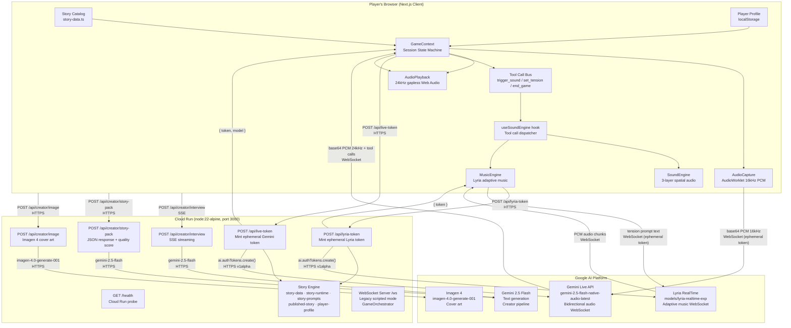

# InnerPlay — System Architecture

## Overview

InnerPlay is a real-time AI voice-narrative game. The player speaks into their microphone; a Gemini Live AI voice character responds and drives an interactive story. A three-layer spatial audio system runs underneath, reacting to narrative tension in real time. A separate Creator pipeline lets anyone compose and publish original stories using Gemini 2.5 Flash as an interview/authoring assistant.

---

## 1. Component List

| Component | Description |
|-----------|-------------|
| **Player Browser (Next.js client)** | React SPA rendered by Next.js 15. Hosts all game UI, audio engines, and WebSocket logic. |
| **GameContext** (`src/context/GameContext.tsx`) | Central React context managing the full Live session lifecycle: token fetch, WebSocket connect to Gemini, audio I/O, tool-call dispatch, retry/resume logic, and session state machine. |
| **AudioCapture** (`src/lib/audio-capture.ts`) | Captures microphone via `getUserMedia`. Runs an AudioWorklet on the audio thread to downsample native rate (44.1/48 kHz) to 16 kHz PCM. Encodes Float32 → Int16 → base64 and forwards chunks to GameContext. |
| **AudioPlayback** (`src/lib/audio-playback.ts`) | Receives base64 Int16 PCM at 24 kHz from Gemini. Decodes and schedules chunks via Web Audio API for gapless playback. |
| **SoundEngine** (`src/lib/sound-engine.ts`) | Manages three audio layers: (1) ambient/timeline sounds, (2) AI-triggered one-shot cues, (3) TTS ducking. Uses story-specific spatial panning maps and per-phase volume timelines. Runs entirely in the browser via Web Audio API. |
| **MusicEngine** (`src/lib/music-engine.ts`) | Optional fourth audio layer. Connects to Lyria RealTime via its own WebSocket (ephemeral token). Streams AI-generated adaptive music as PCM chunks routed through a dedicated GainNode. Tension level is updated via `set_tension` tool calls. |
| **useSoundEngine** (`src/hooks/useSoundEngine.ts`) | React hook wiring SoundEngine + MusicEngine to game state. Handles TTS ducking toggling, story-specific phone-pickup sequences, AI-text keyword cue parsing, transcript-intent fallback cues, and pause/resume lifecycle. |
| **POST /api/live-token** (`src/app/api/live-token/route.ts`) | Server-side route. Uses the server's `GEMINI_API_KEY` to mint a single-use ephemeral token via `ai.authTokens.create`. Embeds the full system prompt, voice config, tool declarations, and Live session parameters inside the token so they cannot be observed or overridden client-side. Returns `{ token, model }`. |
| **POST /api/lyria-token** (`src/app/api/lyria-token/route.ts`) | Mints an ephemeral token scoped to `models/lyria-realtime-exp`. Same pattern as live-token. Guarded by `NEXT_PUBLIC_ENABLE_LYRIA_REALTIME` flag. |
| **GET /health** (`src/app/api/health/route.ts`) | Returns `200 ok`. Used by Cloud Run health checks. |
| **Story Engine** (`src/lib/story-data.ts`, `src/lib/story-runtime.ts`, `src/lib/story-prompts.ts`) | Static story catalog with metadata, runtime mode (`live` vs `scripted`), sound strategy (`ambient_first_live` vs `timeline_scripted`), and the system prompt assembly functions consumed by `/api/live-token`. |
| **Player Profile** (`src/lib/player-profile.ts`) | Questionnaire-driven psychographic profile stored in `localStorage`. Captures identity summary, behavioral profile (conflict style, tolerance levels), emotional map, narrative profile (unfinished decisions, feared/desired identities), and candidate inner selves. Read by the Creator pipeline to personalize story packs. |
| **Live Tool Declarations** (`src/lib/config/live-tools.ts`) | Defines three function declarations passed to Gemini: `trigger_sound` (play a named cue), `set_tension` (0.0–1.0 narrative tension), `end_game` (graceful session close). Contains the parser `parseLiveToolCall` used to decode function calls from Gemini into typed events. |
| **Creator Interview API** (`src/app/api/creator/interview/route.ts`) | SSE-streaming endpoint. Uses `gemini-2.5-flash` to conduct a structured creative brief interview, returning incremental `message`, `spec_update`, `image_prompt`, and `complete` chunks. |
| **Creator Story-Pack API** (`src/app/api/creator/story-pack/route.ts`) | POST endpoint. Takes a completed `CreatorSpec` + optional player profile context + optional draft text. Uses `gemini-2.5-flash` to generate a full `CreatorStoryPack`: title, logline, player role, opening line, 5-phase outline, 3–6 sound cues, and a system prompt draft. Runs a rule-based quality checker and returns both. |
| **Creator Image API** (`src/app/api/creator/image/route.ts`) | Generates cover art via `imagen-4.0-generate-001` from the interview-derived image prompt. |
| **Published Story** (`src/lib/published-story.ts`) | Normalizes a `CreatorStoryPack` into a `PublishedStoryManifest` and assembles the runtime system prompt that `/api/live-token` uses for creator-authored stories. |
| **Custom Server** (`server.ts`) | Node.js HTTP server wrapping Next.js. Also runs a `ws` WebSocket server on `/ws`. Handles the legacy text/scripted game mode: loads YAML story configs, manages `GameOrchestrator` sessions, dispatches `INIT`, `AUDIO_CHUNK`, `CHOICE_SELECTED`, and `PING` messages to Gemini adapters. |
| **Cloud Run** | Hosts the containerized Next.js app. Single container (node:22-alpine). Port 3000. Built with `npm run build`, started with `tsx server.ts`. |
| **Gemini Live API** | Google's real-time multimodal WebSocket API. Used for the core voice-narrative AI character (`gemini-2.5-flash-native-audio-latest`). Streams bidirectional audio with affective dialog, session resumption, and context window compression enabled. |
| **Lyria RealTime** (`models/lyria-realtime-exp`) | Google's generative music model accessed via the Live API. Receives text prompts describing tension level and direction; responds with continuous PCM audio. Optional; soft-fails if unavailable. |
| **Gemini 2.5 Flash** | Text generation model used by the Creator pipeline for interview, story-pack generation, and quality evaluation. |
| **Imagen 4** | Image generation model used for creator-authored story cover art. |

---

## 2. Data Flow — Play Session (Step by Step)

```
1.  Player opens browser → Next.js client renders home page (story catalog loaded from src/lib/story-data.ts).

2.  Player selects a story and taps Play.
    - If a Player Profile exists in localStorage, it is loaded (innerplay.player-profile:v1).
    - GameContext initializes session state machine to "idle".

3.  Player taps Start / confirms microphone permission.
    - Browser requests microphone via navigator.mediaDevices.getUserMedia().
    - AudioCapture initializes an AudioWorklet on the browser's audio thread.

4.  GameContext calls POST /api/live-token (HTTP, from browser to Cloud Run).
    - Body: { storyId } or { publishedStory: <manifest> }
    - Server reads GEMINI_API_KEY (server-side env var — never exposed to client).
    - Server calls ai.authTokens.create() against Gemini API (v1alpha) with:
        * model: gemini-2.5-flash-native-audio-latest (with fallbacks)
        * systemInstruction: assembled story system prompt (locked into token)
        * voiceConfig: Charon
        * tools: LIVE_TOOL_DECLARATIONS (trigger_sound, set_tension, end_game)
        * inputAudioTranscription, outputAudioTranscription, sessionResumption
        * enableAffectiveDialog: true
        * realtimeInputConfig: END_SENSITIVITY_LOW, silenceDurationMs: 1200
        * uses: 1 (single-use), expireTime: 1 hour
    - Server returns { token, model } to the browser.

5.  GameContext opens a WebSocket directly to Gemini Live API using the ephemeral token.
    - Connection: GoogleGenAI client in the browser, apiKey = ephemeral token, v1alpha.
    - Status transitions: idle → connecting → playing.

6.  Gemini sends an opening turn (AI speaks first).
    - GameContext receives audio chunks and forwards them to AudioPlayback.
    - AudioPlayback decodes base64 Int16 PCM (24 kHz) → Web Audio API → speakers.
    - isSpeaking flag set to true → SoundEngine starts TTS ducking (ambient volume lowered).
    - For "the-call" story: first isSpeaking event triggers phone-pickup sequence (stop ring, play click).

7.  SoundEngine initializes concurrently with game start.
    - Loads story-specific synthetic sounds via generateSoundsForStory().
    - Starts the deterministic timeline (e.g., ambient layers fade in/out on a scripted schedule).
    - Applies story-specific spatial panning map (e.g., ocean: pan -0.4, wind: pan +0.3).
    - If adaptive music is enabled: MusicEngine calls POST /api/lyria-token, opens a second
      WebSocket to Lyria RealTime, begins streaming ambient music.

8.  AudioCapture streams microphone PCM to Gemini Live API (WebSocket, binary frames).
    - AudioWorklet downsamples to 16 kHz, emits 100 ms chunks (1600 samples).
    - Each chunk is Float32 → Int16 → base64 → sent via session.sendRealtimeInput().
    - Gemini's automatic activity detection handles silence / end-of-speech.

9.  Player speaks. Gemini processes voice in real time.
    - Gemini streams AI audio response back as base64 PCM chunks.
    - GameContext queues them to AudioPlayback for gapless scheduling.
    - Simultaneously, Gemini may emit text transcripts (input and output).
    - Gemini may emit function calls (trigger_sound, set_tension, end_game).

10. Tool calls are dispatched from GameContext to registered listeners (useSoundEngine).
    - trigger_sound → SoundEngine.handleToolCall() → plays named cue at specified volume/loop.
    - set_tension → MusicEngine.updateTension() → sends new tension prompt to Lyria WebSocket.
    - end_game → SoundEngine.fadeAllToNothing() → status transitions to "ended".

11. Session ends (AI calls end_game, player navigates away, or error/timeout).
    - GameContext closes Gemini WebSocket session.
    - SoundEngine and MusicEngine are destroyed (AudioContext closed, all nodes disconnected).
    - Status machine moves to "ended".
```

---

## 3. ASCII Architecture Diagram

```
┌─────────────────────────────────────────────────────────────────────────────┐
│                         PLAYER'S BROWSER (Next.js Client)                   │
│                                                                              │
│  ┌──────────────────┐    ┌──────────────────────────────────────────────┐   │
│  │  Story Catalog   │    │              GameContext (React)              │   │
│  │  (story-data.ts) │    │                                              │   │
│  │  Player Profile  │───▶│  session state machine (idle/connecting/     │   │
│  │  (localStorage)  │    │  playing/ended/error)                        │   │
│  └──────────────────┘    │                                              │   │
│                           │  ┌────────────┐   ┌───────────────────────┐│   │
│                           │  │AudioCapture│   │    AudioPlayback      ││   │
│                           │  │            │   │                       ││   │
│                           │  │Mic →       │   │base64 PCM 24kHz →     ││   │
│                           │  │AudioWorklet│   │AudioContext → speakers ││   │
│                           │  │→ 16kHz PCM │   └───────────────────────┘│   │
│                           │  └──────┬─────┘                            │   │
│                           └─────────┼────────────────┬─────────────────┘   │
│                                     │                 │                      │
│                           ┌─────────▼──────────────────────────────────┐   │
│                           │        useSoundEngine hook                  │   │
│                           │                                              │   │
│   ┌──────────────────┐    │  ┌──────────────────┐  ┌──────────────────┐│   │
│   │  Tool Call Bus   │───▶│  │   SoundEngine    │  │   MusicEngine    ││   │
│   │ trigger_sound    │    │  │                  │  │                  ││   │
│   │ set_tension      │    │  │Layer 1: Ambient  │  │Lyria adaptive    ││   │
│   │ end_game         │    │  │Layer 2: AI cues  │  │music via         ││   │
│   └──────────────────┘    │  │Layer 3: TTS duck │  │WebSocket         ││   │
│                           │  │+ spatial panning │  │(optional)        ││   │
│                           │  └──────────────────┘  └────────┬─────────┘│   │
│                           └──────────────────────────────────┼──────────┘   │
│                                                               │              │
└──────────────┬────────────────────────────────────────────────┼─────────────┘
               │                                                │
               │ HTTPS POST /api/live-token                     │ HTTPS POST /api/lyria-token
               │ HTTPS POST /api/lyria-token                    │
               │                                                │
┌──────────────▼────────────────────────────────────────────────┼─────────────┐
│                    CLOUD RUN (node:22-alpine, port 3000)        │             │
│                    server.ts (tsx) + Next.js custom server      │             │
│                                                                 │             │
│  ┌──────────────────┐  ┌───────────────┐  ┌─────────────────┐ │             │
│  │POST /api/        │  │POST /api/     │  │GET /health      │ │             │
│  │live-token        │  │lyria-token    │  │                 │ │             │
│  │                  │  │               │  │returns 200 ok   │ │             │
│  │- validates key   │  │- guarded by   │  │(Cloud Run probe)│ │             │
│  │- assembles       │  │  feature flag │  └─────────────────┘ │             │
│  │  system prompt   │  │- mints single │                       │             │
│  │- mints ephemeral │  │  use token    │                       │             │
│  │  token (1hr, 1x) │  │  for Lyria   │◄──────────────────────┘             │
│  └────────┬─────────┘  └──────┬────────┘                                    │
│           │                   │                                              │
│  ┌────────▼───────────────────▼──────────────────────────────────────────┐  │
│  │                 Story Engine                                           │  │
│  │  story-data.ts → story-runtime.ts → story-prompts.ts                 │  │
│  │  published-story.ts (creator stories)                                 │  │
│  │  player-profile.ts (personalization context)                          │  │
│  └───────────────────────────────────────────────────────────────────────┘  │
│                                                                              │
│  ┌───────────────────────────────────────────────────────────────────────┐  │
│  │                 Creator Pipeline API Routes                            │  │
│  │  POST /api/creator/interview  (SSE, gemini-2.5-flash)                 │  │
│  │  POST /api/creator/story-pack (JSON, gemini-2.5-flash)                │  │
│  │  POST /api/creator/image      (imagen-4.0-generate-001)               │  │
│  └───────────────────────────────────────────────────────────────────────┘  │
│                                                                              │
│  ┌───────────────────────────────────────────────────────────────────────┐  │
│  │  WebSocket Server (/ws path)   — legacy scripted mode                 │  │
│  │  GameOrchestrator + GeminiStoryEngine/MockStoryEngine                 │  │
│  │  Messages: INIT, AUDIO_CHUNK, CHOICE_SELECTED, PING/PONG              │  │
│  └───────────────────────────────────────────────────────────────────────┘  │
└──────────────────────────────────┬───────────────────────────────────────────┘
                                   │
                                   │ ai.authTokens.create() — HTTPS (v1alpha)
                                   │
┌──────────────────────────────────▼───────────────────────────────────────────┐
│                           GOOGLE AI PLATFORM                                  │
│                                                                                │
│  ┌──────────────────────────┐   ┌──────────────────────┐                      │
│  │  Gemini Live API         │   │  Gemini 2.5 Flash     │                      │
│  │  gemini-2.5-flash-       │   │  (text generation)   │                      │
│  │  native-audio-latest     │   │  Used by Creator     │                      │
│  │                          │   │  interview +         │                      │
│  │  ◄── WebSocket ──►       │   │  story-pack routes   │                      │
│  │  (browser direct,        │   └──────────────────────┘                      │
│  │   ephemeral token)       │                                                  │
│  │                          │   ┌──────────────────────┐                      │
│  │  - Audio in/out          │   │  Lyria RealTime       │                      │
│  │  - Affective dialog      │   │  models/lyria-        │                      │
│  │  - Session resumption    │   │  realtime-exp        │                      │
│  │  - Context compression   │   │                      │                      │
│  │  - Tool calls            │   │  ◄── WebSocket ──►   │                      │
│  │    (trigger_sound,       │   │  (browser direct,    │                      │
│  │     set_tension,         │   │   ephemeral token)   │                      │
│  │     end_game)            │   │  Adaptive music PCM  │                      │
│  └──────────────────────────┘   └──────────────────────┘                      │
│                                                                                │
│  ┌──────────────────────────┐                                                  │
│  │  Imagen 4                │                                                  │
│  │  imagen-4.0-generate-001 │                                                  │
│  │  Creator cover art       │                                                  │
│  └──────────────────────────┘                                                  │
└────────────────────────────────────────────────────────────────────────────────┘


CREATOR PIPELINE (separate flow, same Cloud Run instance):

  Browser                     Cloud Run API Routes            Google AI Platform
  ────────                    ─────────────────────           ──────────────────
  Creator UI  ──SSE──►  POST /api/creator/interview  ──►  Gemini 2.5 Flash
               ◄──────  (message/spec_update/complete)
                                    │
                                    ▼ (when interview done)
              ──POST──►  POST /api/creator/story-pack  ──►  Gemini 2.5 Flash
               ◄──────  { storyPack, quality }
                                    │
              ──POST──►  POST /api/creator/image       ──►  Imagen 4
               ◄──────  { imageUrl }
                                    │
                         PublishedStoryManifest assembled client-side
                                    │
                         Player taps Play on creator story
                                    │
                         POST /api/live-token (with publishedStory body)
                                    │
                         Story prompt built from manifest → ephemeral token minted
                                    │
                         Standard play session begins (same flow as above)
```

---

## 4. Mermaid Diagram



---

## 5. Connection Types

| Connection | Protocol | Direction | Notes |
|------------|----------|-----------|-------|
| Browser → `/api/live-token` | HTTPS POST | Client → Server | Sends `{ storyId }` or `{ publishedStory }`. Response: `{ token, model }`. |
| Browser → `/api/lyria-token` | HTTPS POST | Client → Server | No body. Response: `{ token }`. Only active when `NEXT_PUBLIC_ENABLE_LYRIA_REALTIME=true`. |
| Server → Gemini `authTokens.create` | HTTPS (v1alpha) | Server → Google API | Uses server-side `GEMINI_API_KEY`. Embeds full session config in the minted token. |
| Browser → Gemini Live API | WebSocket (WSS) | Bidirectional | Opened by `GoogleGenAI` client using ephemeral token as the API key. Carries base64 PCM audio in both directions, plus JSON messages for tool calls and transcripts. |
| Browser → Lyria RealTime | WebSocket (WSS) | Bidirectional | Opened by MusicEngine using Lyria ephemeral token. Sends text tension prompts; receives PCM audio chunks. |
| Browser → `/api/creator/interview` | HTTPS POST, SSE response | Client → Server | Server-Sent Events stream: `message`, `spec_update`, `image_prompt`, `complete` chunks. |
| Browser → `/api/creator/story-pack` | HTTPS POST | Client → Server | Synchronous. Response: `{ storyPack, quality }`. |
| Browser → `/api/creator/image` | HTTPS POST | Client → Server | Synchronous. Response: image data/URL. |
| Server → Gemini 2.5 Flash | HTTPS | Server → Google API | Used by `generateContent()` in creator interview and story-pack routes. |
| Server → Imagen 4 | HTTPS | Server → Google API | Used by creator image route. |
| Player Profile read | localStorage | In-browser | Key: `innerplay.player-profile:v1`. Read by GameContext at session start and by Creator pipeline for prompt personalization. Never sent to the server for play sessions — only optionally included in story-pack requests. |
| Legacy game mode | WebSocket (`/ws`) | Bidirectional | `server.ts` WebSocket server. Messages: `INIT`, `AUDIO_CHUNK`, `CHOICE_SELECTED`, `PING/PONG`. Used by the scripted story runtime (GameOrchestrator). |

---

## 6. Google Cloud / Google AI Services Used

| Service | API / Model | Used For |
|---------|-------------|----------|
| **Google Cloud Run** | Managed serverless container | Hosts the entire Next.js application and API routes. Auto-scales. |
| **Gemini Live API** | `gemini-2.5-flash-native-audio-latest` | Real-time bidirectional audio for the AI narrative character. Supports affective dialog, session resumption, context window compression, automatic activity detection, and function calling. |
| **Gemini Live API (ephemeral tokens)** | `ai.authTokens.create` (v1alpha) | Server-minted single-use tokens (1 hour TTL) that embed the system prompt and session config. Eliminates the need for a WebSocket proxy — the browser connects directly to Gemini without exposing the master API key. |
| **Gemini 2.5 Flash** | `gemini-2.5-flash` | Creator pipeline: interview assistant, story-pack generation, and (implicitly) quality analysis. |
| **Lyria RealTime** | `models/lyria-realtime-exp` | Optional adaptive background music. Receives narrative tension prompts; streams cinematic PCM audio continuously. |
| **Imagen 4** | `imagen-4.0-generate-001` | Creator pipeline: generates cover art images from interview-derived image prompts. |
| **Google GenAI SDK** | `@google/genai` npm package | Unified SDK for all Gemini and Lyria interactions (REST + WebSocket). |

> **Note on key architecture:** The API key (`GEMINI_API_KEY`) lives only on the Cloud Run server. The browser never sees it. Instead, `/api/live-token` and `/api/lyria-token` exchange it for short-lived, single-use ephemeral tokens. This means Gemini WebSocket connections run browser-direct — no WebSocket proxy hop, no additional latency layer — while the secret stays server-side.

---

## 7. Audio Layer Architecture (Detail)

```
Web Audio API graph (all in-browser):

Microphone
    │
    ▼
MediaStreamSource
    │
    ▼
AudioWorklet (PCM Capture Processor)
    │  downsample: native rate → 16kHz
    │  encode: Float32 → Int16 → base64
    │
    ▼ postMessage to main thread
    │
    └──► session.sendRealtimeInput() ──► Gemini Live API (WebSocket)


Gemini Live API (WebSocket) ──► base64 PCM 24kHz chunks
    │
    ▼
AudioPlayback.play()
    │  decode: base64 Int16 → Float32
    │  schedule: gapless via nextStartTime
    │
    ▼
AudioBufferSourceNode ──► AudioContext.destination (speakers)


SoundEngine (three layers, all mixed into shared AudioContext):

    Layer 1: Ambient timeline
        AudioBufferSourceNode(s) + GainNode(s)
        Panned via StereoPannerNode per sound ID
        Volume follows scripted timeline (TIMELINES per storyId)

    Layer 2: AI-triggered one-shot cues
        Fired by trigger_sound tool calls or keyword fallback
        Same pan/volume system, cooldown-gated

    Layer 3: TTS ducking
        When isSpeaking=true: GainNode master gain → 0.4x
        When isSpeaking=false: GainNode master gain → 1.0x


MusicEngine (optional, separate AudioContext branch):

    /api/lyria-token (HTTPS) ──► ephemeral Lyria token
        │
        ▼
    ai.live.connect() (WebSocket) ──► Lyria RealTime
        │  tension prompt text ──►
        │  ◄── PCM audio chunks
        │
        ▼
    AudioBufferSourceNode ──► AuxGainNode ──► AudioContext.destination
        gain: 0.3 base, crossfades on tension update
        auto-reconnect: 1 attempt on unexpected close
```
